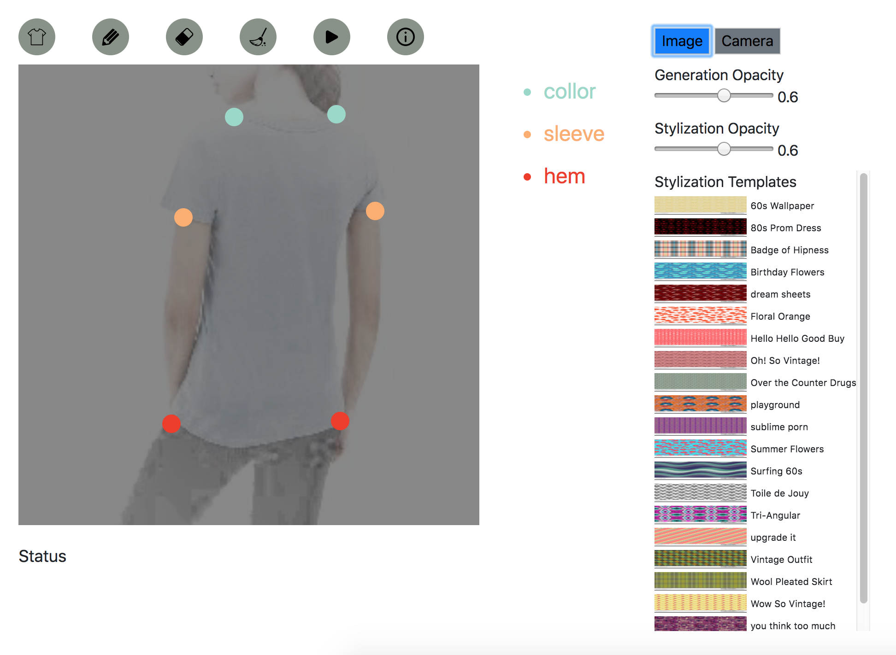

## A Complete Demo ##

## How to use ##

* activate a Python3.5 environment

* `pip install -r requirements.txt`

* download [stage1-epoch-150.h5](https://drive.google.com/open?id=16vK6cVPlz0u9T6uI_I1CO35aocVDtKCn) and [stage2-epoch-150.h5](https://drive.google.com/open?id=1SZ5t_7jPQBCObY5aSurNQOG5jFxwwpYZ), and put them on the current folder

* `FLASK_APP=custom.py flask run`

* open `http://127.0.0.1:5000/demo` with Chrome